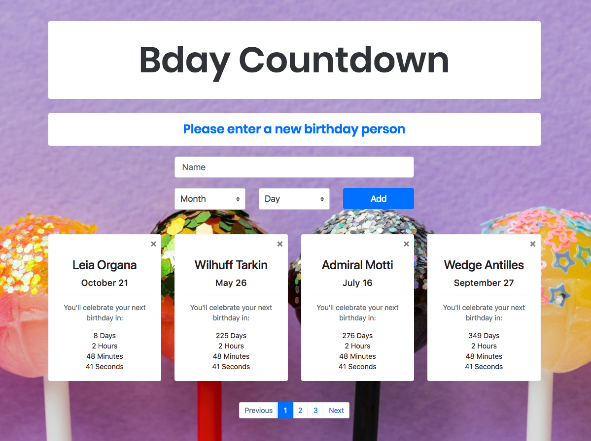

# Project Title

Birthday Countdown Calculator 3

## Live Demo

[https://pndiogo.github.io/bday3/](https://pndiogo.github.io/bday3/)

## Info

Online tool to calculate the time missing for the next birthday. Database is reset every 24h.

## Related Projects

- **Birthday Countdown Calculator 1** - [bday1](https://github.com/pndiogo/bday)

Online tool that calculates time missing for next birthday for some of my close family members. Static content.

## Built With

- HTML5
- CSS3
- JS
- jQuery
- Bootstrap 4
- Animate CSS
- Fetch API
- Git
- NPM

## Authors

- Paulo Diogo - [pndiogo](https://github.com/pndiogo)

## License

This project is licensed under the MIT License - see the [LICENSE.md](LICENSE.md) file for details
